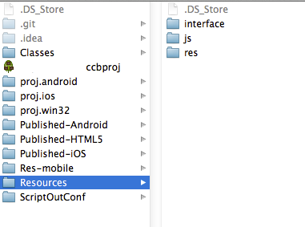
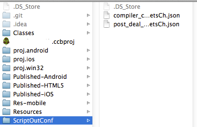

#cocos2dx-jsbinding-quick-scripts
这里是osx下cocos2dx-jsbinding用的一些脚本，快捷的调用一些官方的工具，做东西稍微方便一点。以下全是在mac下写的，其他系统没测试过，反正改起来应该也很简单。
##compile_jsc_then_pos_deal
这个用来快捷的编译jsc，并且做一些后期处理工作，比如去掉原有的js，并且复制一些ios，android专门需要的文件进去。

##使用前需要做的准备
###1.设置环境变量
在~/.bash_profile里面加入以下环境变量
```
export COCOS2DX_ROOT=/Users/Orca/develop/cocos2d-x
```
###2.按照以下方式设置工程文件夹
如图





###3.调用工具

####compile_jsc.py
这个用来编译jsc，调用的是官方的cocos2d.py jscompile。因为命令太长了每次都要敲一遍很麻烦所以才写出来的。
编译以后会在ios和android的资源文件夹里同时创建一份副本。
目前json文件还是要自己写，以后我会尽快弄一个可以直接创建json文件的脚本。
#####用法
按照脚本里面写好的规则创建对应的资源文件夹（实际上就是cocosbuilder建立的文件夹）
和对应的.json文件，然后运行
```
python compile_jsc.py -c project_name
```
####post_deal.py
这个是用来删除多余的js文件（编译以后当然原来的js文件就不需要了）。同时解决cocosbuilder的一些不足（没办法在每个对应的平台当中使用不同的文件）。
#####用法
```
python post_deal.py -d project_name
```
####compile_jsc_then_pos_deal.sh
以上两个脚本的组合。同时完成两个工作。
#####用法
```
compile_jsc_then_pos_deal.sh project_name
```
